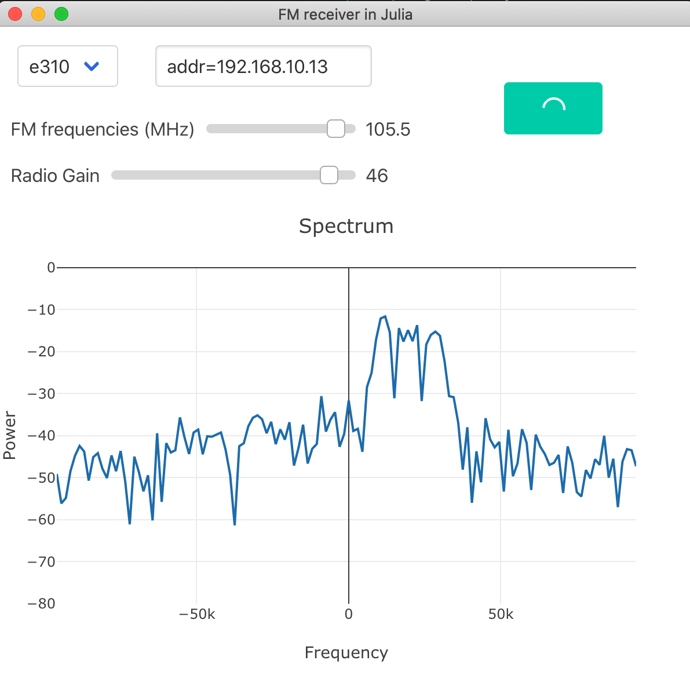

# AbstractSDRsFMReceiver.jl 


## Introduction

This packages proposes a interface to use a Software Defined Radio (SDR) as a simple Frequency Modulation (FM) receiver. It uses frequencies defined in Europe. 
The SDR monitoring is based on [https://github.com/JuliaTelecom/AbstractSDRs.jl](AbstractSDRs.jl). 

Note that this package is highly for prototyping as  it proposes a simple GUI and offers some very basic processing (that can be modified based on the desired purpose). Please feel free to send any PR to enhance this application !   

## To launch the FM receiver 

The following command launch the GUI 
```julia 
AbstractSDRsFMReceiver.gui();
```

It launches a GUI based on Blink and Electron. Parameters are straightforward are listed below 
- The radio type: following AbstractSDRs backends 
- AbstractSDRs options for the radio (for instance radio IP address)
- The desired frequency with a slider 
- The desired gain with a slider 


## Installation 

The installation can be done by adding the repository to Julia 
```julia 
] add https://github.com/JuliaTelecom/AbstractSDRsFMReceiver.jl
```

Note that the audio support is done with `PortAudio` which is not in the Julia repository anymore, so you have to add the PortAudio package first 
```julia 
] add  https://github.com/JuliaAudio/PortAudio.jl#master
```
